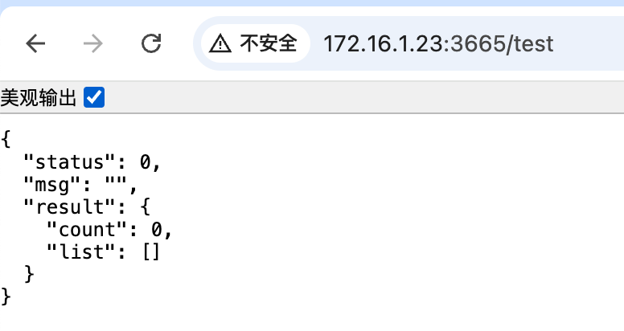
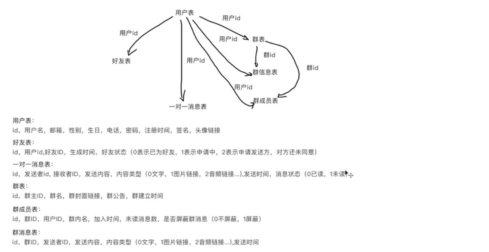
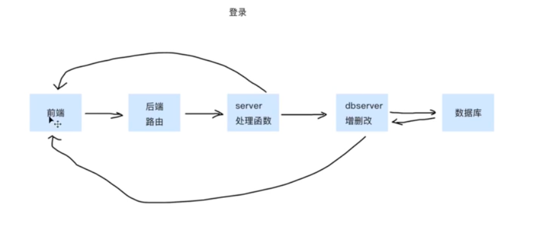

250113

0、初始化

express文档地址

```
https://www.expressjs.com.cn/starter/hello-world.html
```


1、新建node项目express

```bash
server % cnpm i express@next mongoose cors
```


2、测试代码

```js
const express = require('express')
const app = express()
const port = 3666

app.get('/', (req, res) => {
  res.send('Hello World!1')
})

app.listen(port, () => {
  console.log(`Example app listening on port ${port}`)
})
```

3、启动
```js
 server % nodemon app.js
```

4、关于基础的400 和 500 错误处理

5、建立新的路由文件

6、关于跨域的处理
```js
const cors = require('cors');
// 使用 CORS 中间件，允许所有跨域请求
app.use(cors());
```


7、（重点）连接数据库--mongodb
```bash 
npm install mongoose --save
```


创建初步连接

`IM/server/config/db.js`

`IM/server/model/dbmodel.js`

`IM/server/data/dbserver.js`

`IM/server/router/index.js`




8、数据表的设计



数据库操作


> - 用户详情
> - 更新资料
> - 修改昵称


9、连接邮箱

邮箱代理


---



10、密码加密/用户注册接口

密码加密Bcryptjs(未完善)

```bash
server % cnmp install bcryptjs
```

11、token的使用/用户登录接口

```bash
server % cnpm install jsonwebtoken
```

12、搜索接口
搜用户-判断是否为好友
搜群-判断是否在群中

13、好友详情
用户信息修改
好友昵称修改